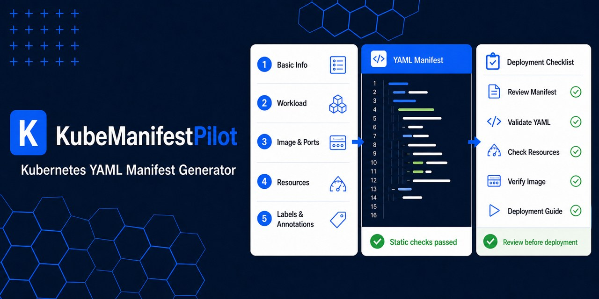

# KubeManifestPilot — Kubernetes YAML Manifest Generator

KubeManifestPilot is a free, browser-based Kubernetes manifest generator. A guided questionnaire produces deterministic Kubernetes YAML, validation warnings, a reusable questionnaire JSON file, and a step-by-step deployment guide. It runs entirely in the browser and never connects to or modifies your Kubernetes cluster.

The landing page includes a compact quick-start questionnaire for choosing a template, project, and environment. The full five-step questionnaire remains on the Generator page so the homepage stays useful for search, sharing, and first-time visitors.

[繁體中文](./README.zh-TW.md) · [Questionnaire](./generator/) · [Templates](./templates/) · [Architecture Designer](./designer/)



## What it generates

- Namespace, Deployment, Service, ConfigMap
- PostgreSQL StatefulSet with headless and client Services
- Persistent storage through `volumeClaimTemplates`
- Optional NodePort, Ingress, or LoadBalancer exposure, HorizontalPodAutoscaler, and PodDisruptionBudget
- Optional per-workload `nodeSelector` constraints based on existing Node labels
- `DEPLOY.md` with dry-run, rollout, verification, logs, rollback, and removal guidance
- Sanitized questionnaire JSON for reproducible output
- Responsive light and dark themes; the initial theme follows the browser preference and a manual choice is saved locally

## Guided templates

1. Frontend and backend, one replica each
2. PostgreSQL, single replica
3. Frontend only
4. Backend API only
5. Frontend, backend, and PostgreSQL
6. Backend with external PostgreSQL

“Single replica” describes the workload replica count. KubeManifestPilot can emit a `nodeSelector`, but it does not label, provision, or manage Kubernetes Nodes.

Two checked-in examples are available for review: [frontend/backend single replica](./frontend-backend-single-replica.yaml) and [PostgreSQL single replica](./postgresql-single-replica.yaml). The PostgreSQL file references an existing Secret and is intentionally not HA; use the questionnaire to generate its matching `DEPLOY.md` for your chosen names and Namespace.

## Safety boundary

KubeManifestPilot does not accept kubeconfig files, cluster tokens, passwords, or private keys. It does not execute `kubectl apply`. Generated output passes local consistency rules only; validate it against the target cluster before deployment:

```bash
kubectl apply --dry-run=server --validate=strict -f app.manifest.yaml
kubectl diff -f app.manifest.yaml
```

NodePort uses the Kubernetes default range `30000–32767`. Leaving the field empty lets the control plane allocate a port; manually selecting one requires collision and firewall checks. To constrain a workload to existing Nodes, enter label pairs such as `workload.example.com/tier=frontend`; avoid `nodeName`, which bypasses the scheduler.

## Run locally

Open `index.html` directly in a current Chrome or Edge browser. No build, package installation, server, framework, or CDN is required.

## Deploy to GitHub Pages

1. Create a public GitHub repository named `kube-manifest-pilot`, then push this directory to it.
2. Open **Settings → Pages**.
3. Select **Deploy from a branch** and publish the repository root.
4. Open the Pages URL shown by GitHub.

All navigation uses relative URLs. With the recommended repository name, the project Pages URL is `https://<username>.github.io/kube-manifest-pilot/`. This repository is published at <https://johnsonchang123.github.io/kube-manifest-pilot/>.

## Project links, donations, and ads

Set the public repository and donation URLs in [`assets/js/config.js`](./assets/js/config.js). Empty values remain disabled and show a harmless status message instead of navigating to a fake link.

Advertising is disabled by default. Only set `adsEnabled` after the site is approved by the ad provider and the required consent/privacy behavior is in place. Ad loading is intentionally separate from the questionnaire and generation engine, so network or ad-blocking failures cannot prevent YAML generation.

## Repository topics

Recommended topics: `kubernetes`, `k8s`, `kubernetes-manifests`, `manifest-generator`, `yaml-generator`, `deployment-guide`, `devops`, `cloud-native`, `github-pages`, `vanilla-javascript`.

## Privacy and licensing

See the [privacy notice](./privacy/) and [third-party licensing page](./licenses/). Runtime code currently has no third-party JavaScript dependency. Source availability does not grant reuse rights; see [LICENSE](./LICENSE).

Kubernetes is a trademark of The Linux Foundation. KubeManifestPilot is an independent project and is not endorsed by or affiliated with the Kubernetes project.
